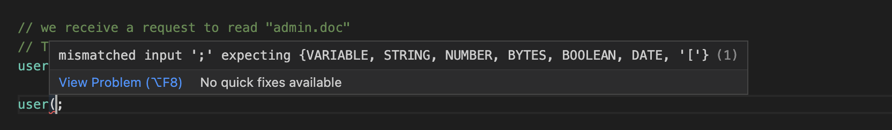

# Datalog browser editor based on Monaco and ANTLR

This is a datalog editor for the browser, based on [Monaco](https://microsoft.github.io/monaco-editor/) and the [ANTLR JavaScript target](https://github.com/antlr/antlr4/blob/master/doc/javascript-target.md). It uses the existing Datalog ANTLR Grammar from [biscuit-net](https://github.com/dmunch/biscuit-net/blob/main/src/parser/Datalog.g4) to lex the input source and provide token scopes to Monaco through a [TokensProvider](https://microsoft.github.io/monaco-editor/typedoc/functions/languages.setTokensProvider.html).

The most interesting part is the implementation of the [`DatalogTokensProvider`](src/DatalogTokensProvider.ts).

## Example

## Usage

See ['index.ts'](./src/demo/index.ts) and ['index.html'](./src/demo/index.html) in the demo folder.

Bundling the webworker code is specific to the chosen bundler, there is an example configuration for webpack in [webpack.config.cjs](./webpack.config.cjs).

## Live Preview

An instance of this editor is deployed to [assets.munch.engineering/biscuit](https://assets.munch.engineering/biscuit/index.html)

## References
- Based on [Writing a browser based editor using Monaco and ANTLR](https://tomassetti.me/writing-a-browser-based-editor-using-monaco-and-antlr/).
- The [AQL Monaco Editor](https://github.com/JohannesOehm/aql-monaco-editor) follows the same approach, and has some code in GitHub.
- Error handling is implemented by following the approach outlined in [Create a Custom Web Editor Using TypeScript, React, ANTLR, and Monaco-Editor](https://betterprogramming.pub/create-a-custom-web-editor-using-typescript-react-antlr-and-monaco-editor-bcfc7554e446)

## Possible Improvements
- Code completion, using the grammar agnostic code completion engine [antlr4-c3](https://github.com/mike-lischke/antlr4-c3)
- Using doc-comments, fact terms could get a description which could be shown as [inline hints](https://microsoft.github.io/monaco-editor/typedoc/interfaces/languages.InlayHintsProvider.html)
- Maybe using a semantic document token provider, as outlined in [Syntax and Semantics](https://authzed.com/blog/syntax-and-semantics/)? Unclear yet what the benefits are